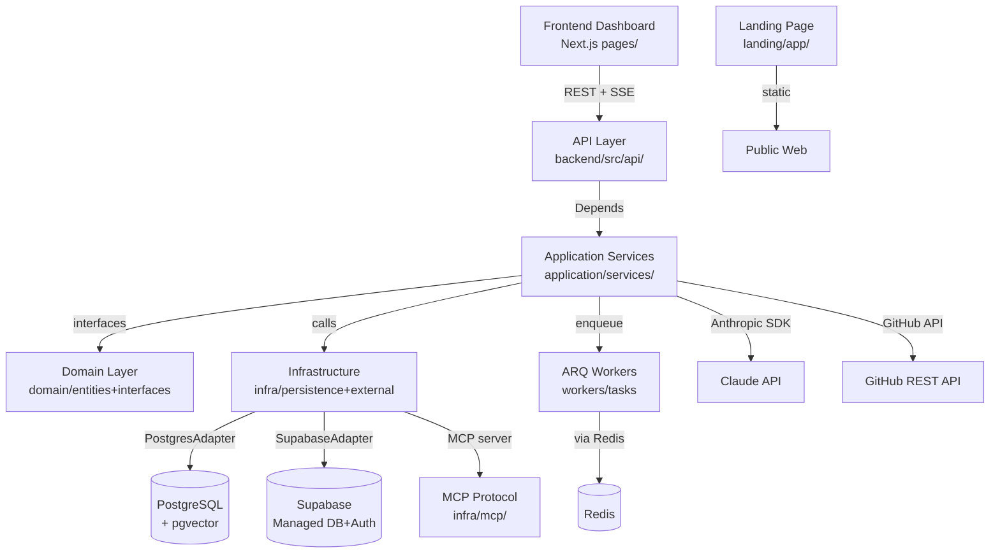

# BitRaptors/Archie — Architecture Map

> Archie is a code analysis and architecture documentation platform that ingests GitHub or local repositories, runs multi-phase AI analysis via Claude, and produces structured blueprints, intent layers, and agent config files. The backend is Python/FastAPI with domain-driven design, async task processing via ARQ/Redis, and dual Supabase/Postgres persistence. The main frontend is a Next.js dashboard for managing analyses and viewing results; the landing app is a separate Next.js site with 3D visuals. Communication between frontend and backend uses REST + SSE for streaming analysis progress.

**Architecture:** Full-stack monorepo with DDD backend (FastAPI/Python) and dual Next.js frontends (main dashboard + landing page) | **Platforms:** backend, frontend, landing | **Generated:** 2026-03-12

## Architecture Diagram



## Directory Structure

```
archie/
├── start-dev.py          # Dev orchestrator
├── backend/
│   ├── src/
│   │   ├── main.py
│   │   ├── api/          # Routes, DTOs, middleware
│   │   ├── application/  # Services, agents
│   │   ├── domain/       # Entities, interfaces, exceptions
│   │   ├── infrastructure/ # Persistence, external, analysis, MCP
│   │   ├── workers/      # ARQ tasks
│   │   └── config/       # Settings, DI container
│   ├── tests/            # unit + integration
│   ├── migrations/       # SQL migration files
│   ├── Dockerfile
│   └── cloudbuild.yaml
├── frontend/             # Next.js dashboard (pages router)
│   ├── pages/
│   ├── components/
│   ├── hooks/api/
│   ├── services/
│   ├── context/
│   └── lib/
└── landing/              # Next.js marketing site (app router)
    ├── app/
    └── components/
```

## Module Guide

### API Layer
**Location:** `backend/src/api/`

FastAPI routes, DTOs, error middleware, SSE streaming

| File | Description |
|------|-------------|
| `backend/src/api/app.py` | FastAPI factory, middleware, route registration |
| `backend/src/api/routes/analyses.py` | Analysis lifecycle endpoints + SSE stream |
| `backend/src/api/dto/requests.py` | Pydantic request validation schemas |
| `backend/src/api/middleware/error_handler.py` | Global exception-to-HTTP mapping |

**Depends on:** Application Layer, Domain Layer

- **FastAPI APIRouter**: Per-domain router modules registered in app.py

### Application Layer
**Location:** `backend/src/application/services/`

Orchestrates use cases; coordinates domain + infra; runs analysis workflows

| File | Description |
|------|-------------|
| `backend/src/application/services/analysis_service.py` | Analysis lifecycle orchestration |
| `backend/src/application/services/phased_blueprint_generator.py` | Multi-phase Claude blueprint generation |
| `backend/src/application/services/delivery_service.py` | Renders and exports blueprints |
| `backend/src/application/services/intent_layer_service.py` | Intent layer synthesis from analysis |

**Depends on:** Domain Layer, Infrastructure Layer

- **AnalysisService**: Primary analysis lifecycle orchestrator
- **PhasedBlueprintGenerator**: Multi-phase LLM blueprint generation with streaming

### Domain Layer
**Location:** `backend/src/domain/`

Core entities, abstract interfaces, domain exceptions; no framework dependencies

| File | Description |
|------|-------------|
| `backend/src/domain/interfaces/database.py` | DatabaseClient, QueryBuilder abstractions |
| `backend/src/domain/interfaces/repositories.py` | All repository interface contracts |
| `backend/src/domain/entities/analysis.py` | Analysis entity with status/metadata |
| `backend/src/domain/entities/blueprint.py` | Blueprint entity for architecture docs |

- **DatabaseClient**: DB-agnostic abstraction in domain/interfaces/database.py
- **IAnalysisRepository**: Abstract analysis persistence contract

### Infrastructure Layer
**Location:** `backend/src/infrastructure/`

Concrete DB adapters, GitHub clients, RAG/embedding engines, storage, MCP, event bus

| File | Description |
|------|-------------|
| `backend/src/infrastructure/persistence/db_factory.py` | Factory selects Postgres or Supabase adapter |
| `backend/src/infrastructure/persistence/postgres_adapter.py` | asyncpg-based DatabaseClient impl |
| `backend/src/infrastructure/analysis/rag_retriever.py` | pgvector similarity search for RAG |
| `backend/src/infrastructure/mcp/server.py` | MCP server exposing tools/resources to Claude |

**Depends on:** Domain Layer

- **PostgresAdapter / SupabaseAdapter**: Dual DatabaseClient implementations selected by db_factory

### Workers
**Location:** `backend/src/workers/`

ARQ background job processing for long-running analyses

| File | Description |
|------|-------------|
| `backend/src/workers/tasks.py` | ARQ task definitions for analysis jobs |
| `backend/src/workers/worker.py` | ARQ WorkerSettings and startup |

**Depends on:** Application Layer

### Frontend Dashboard
**Location:** `frontend/`

Next.js dashboard for repo management, analysis results, settings, blueprint viewing

| File | Description |
|------|-------------|
| `frontend/pages/_app.tsx` | App wrapper with AuthContext provider |
| `frontend/components/views/AnalysisView.tsx` | Analysis results orchestration view |
| `frontend/components/views/BlueprintView.tsx` | Blueprint viewer with TOC and Mermaid |
| `frontend/context/auth.tsx` | Global auth state via React Context |

**Depends on:** Backend API

### Landing Page
**Location:** `landing/`

Marketing site with Three.js shader background and GSAP scroll animations

| File | Description |
|------|-------------|
| `landing/app/page.tsx` | Landing homepage with hero and CTAs |
| `landing/components/ShaderBackground.tsx` | Three.js animated shader background |
| `landing/components/SmoothScroll.tsx` | GSAP/Lenis smooth scroll wrapper |

## Common Tasks

### Add a new analysis capability / feature flag
**Files:** `backend/src/domain/entities/analysis_settings.py`, `backend/src/api/routes/settings.py`, `backend/src/api/dto/requests.py`, `frontend/components/views/CapabilitiesSettingsView.tsx`, `frontend/services/settings.ts`

1. 1. Add new field to AnalysisSettings entity in domain/entities/analysis_settings.py
2. 2. Update settings DTO in api/dto/requests.py and settings route in api/routes/settings.py
3. 3. Add toggle UI in CapabilitiesSettingsView.tsx; update frontend/services/settings.ts to send new field

### Add a new background analysis task
**Files:** `backend/src/workers/tasks.py`, `backend/src/workers/worker.py`, `backend/src/application/services/analysis_service.py`

1. 1. Define async task function in backend/src/workers/tasks.py with ctx parameter
2. 2. Register task in WorkerSettings.functions list in backend/src/workers/worker.py
3. 3. Enqueue from analysis_service.py using arq queue.enqueue('task_name', **kwargs)

### Add a new REST endpoint with frontend integration
**Files:** `backend/src/api/routes/{domain}.py`, `backend/src/api/app.py`, `frontend/services/{domain}.ts`, `frontend/hooks/api/use{Domain}.ts`

1. 1. Create route handler in backend/src/api/routes/{domain}.py using APIRouter; add DTOs
2. 2. Register router in backend/src/api/app.py include_router call
3. 3. Add Axios call in frontend/services/{domain}.ts; create frontend/hooks/api/use{Domain}.ts hook consuming it

### Run and debug analysis pipeline locally
**Files:** `start-dev.py`, `backend/.env.local`, `frontend/.env.local`, `backend/src/workers/tasks.py`

1. 1. Ensure backend/.env.local and frontend/.env.local exist (copy from .env.example); set ANTHROPIC_API_KEY, REDIS_URL, DB credentials
2. 2. Start Redis via docker-compose or local install; run python start-dev.py to launch backend + ARQ worker + frontend
3. 3. Trigger analysis via dashboard at localhost:{frontend_port}; watch worker logs for PhasedBlueprintGenerator phases

## Gotchas

### ARQ Worker / Redis
If Redis is unavailable at startup, start-dev.py falls back to in-process analysis silently — but production deployments require Redis for task persistence. Lost tasks are not retried.

*Recommendation:* Always verify Redis connection before deploying; check REDIS_URL in backend/.env.local; monitor Redis memory to prevent queue overflow

### DB Backend Selection
DB_BACKEND env var controls PostgresAdapter vs SupabaseAdapter selection in db_factory.py; wrong value silently uses wrong adapter, causing query failures.

*Recommendation:* Explicitly set DB_BACKEND='postgres' or DB_BACKEND='supabase' in .env.local; run backend/tests/unit/infrastructure/test_db_factory.py to verify

### Prompts Version Mismatch
start-dev.py checks prompts.json version against .prompts-version file and hard-exits if mismatched — running without ./setup.sh after a pull will block startup.

*Recommendation:* Always run ./setup.sh after pulling changes that bump prompts.json version

### pgvector Embeddings
SharedEmbedder loads full sentence-transformers model on first use (5-10s); vector column dimension must match model output (e.g. 384 for all-MiniLM-L6-v2) or inserts will fail silently.

*Recommendation:* Use singleton pattern (already in shared_embedder.py); ensure vector(N) column dimension matches model in migrations/001_initial_setup.sql

### SSE Frontend Connection
SSE streams from /analyses/{id}/stream are long-lived; if the frontend component unmounts without closing the EventSource, connections leak and Redis/ARQ events accumulate.

*Recommendation:* Always close EventSource in useEffect cleanup function in the consuming hook

## Technology Stack

| Category | Name | Version | Purpose |
|----------|------|---------|---------|
| backend_framework | FastAPI | >=0.104.0 | Async REST API, SSE, OpenAPI docs |
| backend_runtime | Python | 3.11 | Primary backend language |
| task_queue | ARQ | >=0.23.0 | Async Redis-backed background jobs |
| ai_client | Anthropic SDK | >=0.7.0 | Claude API for phased code analysis |
| embeddings | sentence-transformers | >=2.2.0 | Code embedding for RAG retrieval |
| database_driver | asyncpg | >=0.29.0 | Async PostgreSQL driver for PostgresAdapter |
| database_managed | Supabase | >=2.0.0 | Managed Postgres + Auth + PostgREST adapter |
| validation | Pydantic | >=2.5.0 | Request/response/settings schema validation |
| frontend_framework | Next.js | 16.1.6 | Dashboard and landing page React framework |
| styling | Tailwind CSS | ^4 (landing), 3.x (frontend) | Utility-first CSS for both frontends |
| ui_primitives | Radix UI / shadcn | latest | Headless UI primitives in frontend/components/ui/ |
| http_client | Axios | latest | HTTP client in frontend/services/*.ts |
| diagrams | Mermaid | latest | Architecture diagram rendering in BlueprintView |
| 3d_graphics | Three.js | latest | Shader background in landing page |
| animation | GSAP + Lenis | latest | Scroll animations in landing page |
| testing | pytest + pytest-asyncio | >=7.4.0 | Backend unit and integration tests |
| linting_backend | Ruff + mypy | >=0.1.0 | Python linting and type checking |
| cache_queue | Redis | 7-alpine | ARQ queue backend and session cache |

## Run Commands

```bash
# dev_all
python start-dev.py

# backend_only
cd backend && .venv/bin/python src/main.py

# frontend_only
cd frontend && npm run dev

# landing_only
cd landing && npm run dev

# worker
cd backend && PYTHONPATH=src .venv/bin/python -m arq workers.tasks.WorkerSettings

# test_backend
cd backend && .venv/bin/pytest tests/

# lint_backend
cd backend && .venv/bin/ruff check src/

# setup
./setup.sh

```
