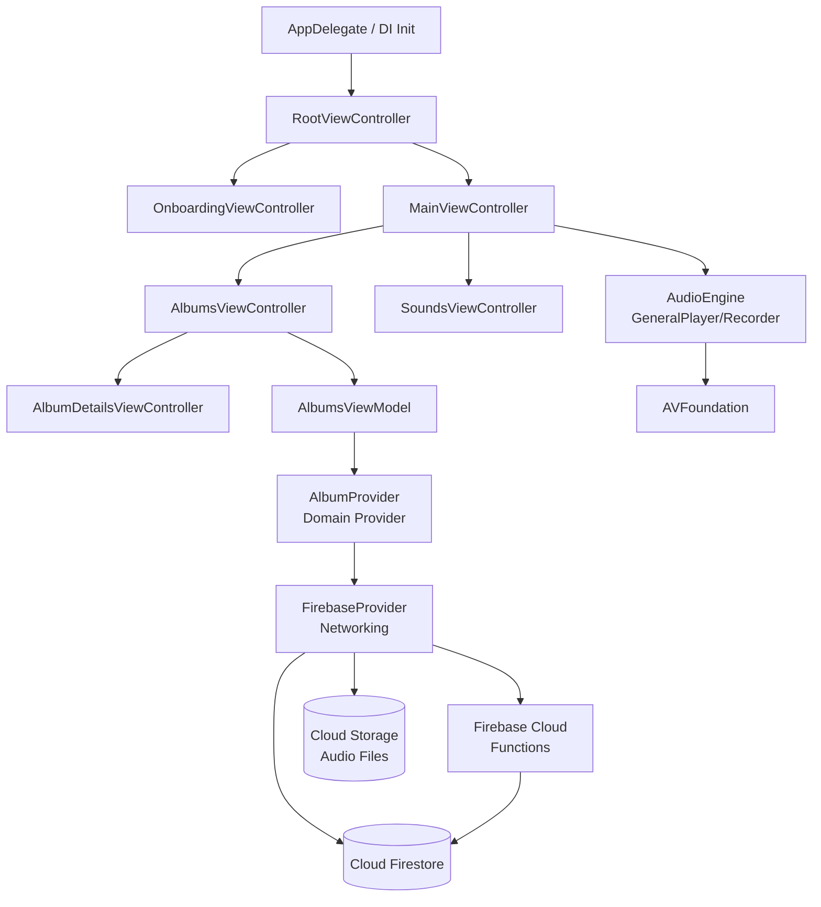

# local/AroundSound — Architecture Map

> AroundSound is a geotagged audio recording and sharing app for iOS and Android backed by Firebase. The iOS app uses MVVM with RxSwift reactive bindings, Swinject DI, and UIKit. The Android app uses MVVM with native Android patterns. The backend is Firebase Cloud Functions (TypeScript/Node.js) with Firestore, Cloud Storage, FCM, and BigQuery. Architecture separates Presentation, ViewModel, Repository, Provider, and Networking layers on iOS with protocol-based abstractions throughout.

**Architecture:** Multi-platform monorepo: iOS MVVM+RxSwift, Android MVVM, Firebase serverless backend | **Platforms:** mobile-ios, mobile-android, backend-firebase-functions | **Generated:** 2026-03-13

## Architecture Diagram



## Directory Structure

```
aroundsound/
├── iOS/
│   └── AroundSound/
│       ├── App/
│       │   ├── Analytics/
│       │   ├── Appdelegate/
│       │   ├── AudioEngine/
│       │   ├── DI/
│       │   ├── Deeplinking/
│       │   ├── Domain/Provider/
│       │   ├── ErrorHandling/
│       │   ├── Location/
│       │   ├── Models/Dtos/
│       │   ├── Networking/Converters/
│       │   ├── SettingsManager/
│       │   ├── Utils/
│       │   ├── ViewModel/AlbumCellTypes/
│       │   ├── ViewModel/Trimming/
│       │   ├── ViewControllers/Animators/
│       │   └── Views/Cells/Player/Recorder/Trim/
│       ├── AppUnitTests/
│       └── AppUITests/
├── android/
│   └── app/src/main/
├── platform/
│   ├── firebase/
│   │   ├── functions/src/
│   │   ├── functions/views/
│   │   └── bin/adhoc/
│   └── tools/bin/adhoc/
└── designs/
```

## Module Guide

### FirebaseProvider
**Location:** `iOS/AroundSound/App/Networking/FirebaseProvider.swift`

Abstracts all Firestore/Storage/Functions SDK calls into RxSwift Observables

| File | Description |
|------|-------------|
| `iOS/AroundSound/App/Networking/FirebaseProvider.swift` | Main Firebase client with Firestore CRUD and real-time listeners |
| `iOS/AroundSound/App/Networking/Sync/FirebaseSyncManager.swift` | Coordinates audio file upload/download operations |

**Depends on:** Firebase SDK, CodableFirebase, Models/Dtos

- **FirebaseProviderProtocol**: Protocol abstracting all Firebase operations for testability

### Domain Providers
**Location:** `iOS/AroundSound/App/Domain/Provider/`

Filtered/computed data views on top of FirebaseProvider; expose Input relays and Output observables

| File | Description |
|------|-------------|
| `iOS/AroundSound/App/Domain/Provider/AlbumProvider.swift` | Album CRUD with Driver output |
| `iOS/AroundSound/App/Domain/Provider/SharedAlbumPreviewProvider.swift` | Deeplink-triggered shared album preview fetching |

**Depends on:** FirebaseProvider, ASErrorFactory

- **AlbumProvider**: Input/Output port pattern for album operations

### ViewModels
**Location:** `iOS/AroundSound/App/ViewModel/`

Presentation logic; transforms domain models to UI-ready formats via RxSwift; receives injected dependencies

| File | Description |
|------|-------------|
| `iOS/AroundSound/App/ViewModel/MainViewModel.swift` | Root ViewModel with ~15 injected dependencies |
| `iOS/AroundSound/App/ViewModel/AlbumsViewModel.swift` | Album list state and CRUD operations |

**Depends on:** Domain Providers, FirebaseProvider, ASErrorFactory, GeneralPlayer, GeneralRecorder

- **MainViewModel**: Root ViewModel coordinating recording, playback, and navigation state

### AudioEngine
**Location:** `iOS/AroundSound/App/AudioEngine/`

Wraps AVFoundation recording and playback in protocol-based RxSwift interfaces

| File | Description |
|------|-------------|
| `iOS/AroundSound/App/AudioEngine/Playback/GeneralPlayer.swift` | Merges local and remote AVPlayer observables |
| `iOS/AroundSound/App/AudioEngine/Recording/GeneralRecorder.swift` | AVAudioRecorder wrapper exposing recordingStatus Driver |

**Depends on:** AVFoundation, RxSwift, MediaPlayer

- **GeneralPlayerProtocol**: Abstracts dual-player (local+remote) with merged Observable streams

### Firebase Cloud Functions
**Location:** `platform/firebase/functions/src/`

Serverless HTTP and Firestore-triggered handlers for all backend business logic

| File | Description |
|------|-------------|
| `platform/firebase/functions/src/index.ts` | Entry point exporting all Cloud Functions |
| `platform/firebase/functions/src/cloud_function_utils.ts` | Shared validation and utility helpers |

**Depends on:** firebase-admin, google-cloud/firestore, google-cloud/bigquery

- **HTTP endpoints**: HTTPS callable functions per domain entity

### DI Container
**Location:** `iOS/AroundSound/App/DI/`

Swinject container registering and resolving all iOS service dependencies

| File | Description |
|------|-------------|
| `iOS/AroundSound/App/DI/DepedencyContainer.swift` | Central Swinject container registration |
| `iOS/AroundSound/App/DI/Resolver.swift` | Type-safe dependency resolution helpers |

**Depends on:** Swinject

### Error Handling
**Location:** `iOS/AroundSound/App/ErrorHandling/`

Typed error hierarchy with factory, severity, and routing to UI

| File | Description |
|------|-------------|
| `iOS/AroundSound/App/ErrorHandling/ASErrorFactory.swift` | Creates typed errors with analytics logging |
| `iOS/AroundSound/App/ErrorHandling/ASErrorRouter.swift` | Routes errors to dialogs/toasts based on severity |

**Depends on:** ASAnalyticsManager

## Common Tasks

### Add a new Firebase-backed feature (e.g. new entity CRUD)
**Files:** `iOS/AroundSound/App/Models/Dtos/RecordingDto.swift`, `iOS/AroundSound/App/Models/Recording.swift`, `iOS/AroundSound/App/Networking/Converters/RecordingConverter.swift`, `iOS/AroundSound/App/Networking/FirebaseProvider.swift`, `iOS/AroundSound/App/Domain/Provider/AlbumProvider.swift`, `iOS/AroundSound/App/ViewModel/AlbumsViewModel.swift`, `iOS/AroundSound/App/DI/DepedencyContainer.swift`, `platform/firebase/functions/src/index.ts`

1. 1. Create Dto in Models/Dtos/ and domain model in Models/; write Converter in Networking/Converters/
2. 2. Add Firestore methods to FirebaseProvider.swift (return Observable); update FirebaseProviderProtocol
3. 3. Create Provider in Domain/Provider/ with PublishRelay inputs and Driver outputs; register in DepedencyContainer.swift
4. 4. Inject Provider into ViewModel; expose Output Driver for ViewController binding
5. 5. Add Cloud Function handler in platform/firebase/functions/src/<domain>.ts; export in index.ts; run npm run build

### Add a new iOS screen
**Files:** `iOS/AroundSound/App/ViewControllers/AlbumsViewController.swift`, `iOS/AroundSound/App/ViewModel/AlbumsViewModel.swift`, `iOS/AroundSound/App/DI/DepedencyContainer.swift`, `iOS/AroundSound/App/DI/Resolver.swift`

1. 1. Create <Name>ViewController.swift in ViewControllers/; create <Name>ViewModel.swift in ViewModel/
2. 2. Define ViewModel struct with injected dependencies and expose Driver outputs + PublishRelay inputs
3. 3. Register ViewModel in DepedencyContainer.swift; add resolve helper in Resolver.swift
4. 4. In ViewController.viewDidLoad() bind ViewModel outputs to UI via .drive(); bind UI events to ViewModel inputs via .bind(to:); add all to disposeBag

### Deploy Firebase Cloud Functions to dev
**Files:** `platform/firebase/functions/src/index.ts`, `platform/firebase/deploy-to-environment.sh`

1. 1. cd platform/firebase/functions && npm run lint && npm run build (compiles TS to lib/)
2. 2. Trigger GitLab CI manual job 'deploy aroundsound-dev' OR run bash deploy-to-environment.sh locally
3. 3. Verify with: firebase functions:log --project aroundsound-dev

### Run a bulk data operation using admin tools
**Files:** `platform/tools/bin/bulk-download.py`, `platform/tools/bin/requirements.txt`

1. 1. pip install -r platform/tools/bin/requirements.txt (Python 2.7 required)
2. 2. Set GOOGLE_APPLICATION_CREDENTIALS to service account JSON for target project
3. 3. python platform/tools/bin/bulk-download.py --project-id=aroundsound-dev <user-id>

## Gotchas

### RxSwift stream termination
Using PublishSubject as input relay will terminate the entire stream on onError(); downstream Providers stop emitting permanently

*Recommendation:* Always use PublishRelay for input ports; reserve PublishSubject only for error subjects that feed errorOutput

### Firebase Firestore snapshot listeners
Firestore real-time listeners are long-lived and not automatically removed when a ViewController is dismissed; causes memory leaks and phantom updates

*Recommendation:* Store the Firestore unsubscribe function and call it in deinit or on navigation away; ensure DisposeBag is deallocated with ViewController

### Swinject DI resolution order
DepedencyContainer.swift registers services in a specific order; circular dependencies or resolving before registration causes silent nil crashes

*Recommendation:* Always register leaf dependencies (ErrorFactory, Analytics) before composite services (Providers, ViewModels) in DepedencyContainer.swift

### Driver vs Observable threading
Binding an Observable (not Driver) to UIKit elements can crash if the observable emits on a background thread from Firestore callbacks

*Recommendation:* Convert all ViewController-bound outputs to Driver via .asDriver(onErrorJustReturn:) before exposing from ViewModels

### Python 2.7 admin tools
platform/tools/bin/ scripts use Python 2.7 syntax (urlparse, print statements, unicode literals); will fail silently on Python 3

*Recommendation:* Always run admin tools with Python 2.7 interpreter; do not port to Python 3 without full regression on Firestore query outputs

## Technology Stack

| Category | Name | Version | Purpose |
|----------|------|---------|---------|
| reactive | RxSwift + RxCocoa | 4.x | Core reactive framework for data binding and event streams on iOS |
| ui | UIKit | iOS 11+ | Native iOS UI framework; ViewControllers, Views, Cells |
| backend | Firebase Cloud Functions | 1.x / Node.js 8 | Serverless TypeScript handlers for all backend logic |
| database | Cloud Firestore | google-cloud-firestore 0.29.0+ | NoSQL document store for recordings, albums, users, comments |
| di | Swinject | 2.x | iOS dependency injection container |
| image | Nuke | latest | Remote image loading and caching |
| layout | SnapKit | latest | Auto Layout DSL for programmatic constraints |
| reactive_datasources | RxDataSources | latest | Reactive UITableView/UICollectionView section-based updates |
| serialization | CodableFirebase | latest | Encode/decode Codable models to/from Firestore documents |
| analytics | Firebase Analytics + AppCenter | 2.x | Event tracking, crash reporting, performance monitoring |

## Run Commands

```bash
# ios_setup
cd iOS/AroundSound && pod install && open AroundSound.xcworkspace

# firebase_dev_setup
cd platform/firebase && bash prepare-local-development-environment.sh

# firebase_functions_build
cd platform/firebase/functions && npm run build

# firebase_functions_lint
cd platform/firebase/functions && npm run lint

# firebase_deploy
cd platform/firebase && bash deploy-to-environment.sh

# firebase_functions_test
cd platform/firebase/functions && npm test

# android_build
cd android && ./gradlew assembleDebug

# android_test
cd android && ./gradlew test

```
