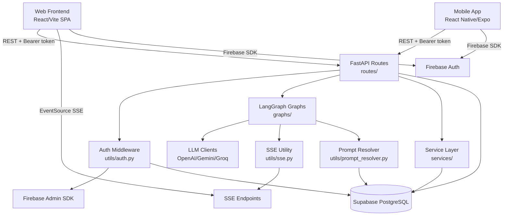

# csacsi/BedtimeApp — Architecture Map

> BedtimeApp (Tuck-in-Tales) is a monorepo generating personalized AI bedtime stories for children. The backend is FastAPI/Python using LangGraph to orchestrate multi-step AI workflows across OpenAI, Gemini, and Groq. The web frontend is a React/Vite SPA and the mobile app uses React Native/Expo with file-based routing. Authentication uses Firebase ID tokens verified by the backend, with Supabase as the primary PostgreSQL database. Real-time story and avatar generation progress is streamed to clients via Server-Sent Events.

**Architecture:** Monorepo with three platforms: FastAPI backend, React SPA web frontend, React Native/Expo mobile app | **Platforms:** backend, web-frontend, mobile-frontend | **Generated:** 2026-03-23

## Architecture Diagram



## Directory Structure

```
BedtimeApp/
├── package.json          # root monorepo scripts (concurrently)
├── package-lock.json
├── DOCS/                 # architecture docs, plans, schema
├── tuck-in-tales-backend/
│   ├── src/
│   │   ├── main.py
│   │   ├── config.py
│   │   ├── routes/       # characters, stories, family, memories, prompts
│   │   ├── models/       # character, story, family, memory, user, prompt
│   │   ├── graphs/       # story_generator, avatar_generator, memory_analyzer
│   │   ├── services/     # family_service
│   │   └── utils/        # auth, sse, supabase, llm clients, prompt_resolver
│   └── tests/
├── tuck-in-tales-frontend/
│   ├── src/
│   │   ├── App.tsx
│   │   ├── pages/        # all route-level page components
│   │   ├── components/   # ui/, Auth/, Layout/, prompts/
│   │   ├── hooks/        # useSSEStream, useStoryStream, etc.
│   │   ├── context/      # AuthContext
│   │   ├── models/       # TS interfaces mirroring backend
│   │   ├── api/          # client.ts
│   │   └── utils/        # firebase, supabaseUtils
│   └── _restore/         # legacy backend backup (do not modify)
└── tuck-in-tales-mobile/
    ├── App.tsx
    ├── app/              # Expo Router: (auth)/, (tabs)/, story/[id].tsx
    └── src/
        ├── api/          # client.ts
        ├── context/      # AuthContext
        ├── hooks/        # queries/, useGoogleSignIn
        ├── models/       # TS interfaces
        ├── config/       # firebase, supabase
        └── utils/        # supabaseUtils
```

## Module Guide

### API Routes
**Location:** `tuck-in-tales-backend/src/routes/`

FastAPI route handlers; delegates to graphs/services; returns JSON or SSE streams

| File | Description |
|------|-------------|
| `tuck-in-tales-backend/src/routes/stories.py` | Story generation + SSE streaming |
| `tuck-in-tales-backend/src/routes/characters.py` | Character CRUD + avatar upload |
| `tuck-in-tales-backend/src/routes/family.py` | Family management endpoints |
| `tuck-in-tales-backend/src/routes/memories.py` | Memory logging endpoints |
| `tuck-in-tales-backend/src/routes/prompts.py` | Prompt CRUD endpoints |

**Depends on:** Authentication, Graph Layer, Service Layer, Supabase Client

- **stories router**: Story creation and SSE streaming endpoint

### Graph Layer
**Location:** `tuck-in-tales-backend/src/graphs/`

LangGraph StateGraph workflows for story, avatar, and memory AI operations

| File | Description |
|------|-------------|
| `tuck-in-tales-backend/src/graphs/story_generator.py` | Story outline → pages → images workflow |
| `tuck-in-tales-backend/src/graphs/avatar_generator.py` | Photo analysis → avatar image workflow |
| `tuck-in-tales-backend/src/graphs/memory_analyzer.py` | Memory text/photo analysis workflow |

**Depends on:** LLM Clients, SSE Utility, Supabase Client, Prompt Resolver

- **story_generator**: Compiled LangGraph for multi-page story generation

### Authentication
**Location:** `tuck-in-tales-backend/src/utils/auth.py`

Verifies Firebase ID tokens; resolves or creates Supabase user records

| File | Description |
|------|-------------|
| `tuck-in-tales-backend/src/utils/auth.py` | Token verification + user provisioning |
| `tuck-in-tales-backend/src/utils/firebase_admin_init.py` | Firebase Admin SDK init |

**Depends on:** Firebase Admin SDK, Supabase Client, User Model

- **verify_firebase_token**: FastAPI Depends() callable returning UserData TypedDict

### SSE Utility
**Location:** `tuck-in-tales-backend/src/utils/sse.py`

asyncio.Queue registry keyed by client_id; emit and stream SSE events

| File | Description |
|------|-------------|
| `tuck-in-tales-backend/src/utils/sse.py` | Queue-based SSE event manager |

- **sse**: Push events to queue; yield formatted SSE strings to StreamingResponse

### LLM Clients
**Location:** `tuck-in-tales-backend/src/utils/`

Provider-specific wrappers for OpenAI, Gemini, Groq APIs

| File | Description |
|------|-------------|
| `tuck-in-tales-backend/src/utils/openai_client.py` | OpenAI chat + image client |
| `tuck-in-tales-backend/src/utils/gemini_client.py` | Google Gemini client |
| `tuck-in-tales-backend/src/utils/groq_client.py` | Groq inference client |

**Depends on:** Configuration

### Web Frontend
**Location:** `tuck-in-tales-frontend/src/`

React SPA with pages, SSE hooks, and auth context for all app features

| File | Description |
|------|-------------|
| `tuck-in-tales-frontend/src/App.tsx` | Root router + AuthProvider + route config |
| `tuck-in-tales-frontend/src/api/client.ts` | Axios HTTP client with auth token injection |
| `tuck-in-tales-frontend/src/context/AuthContext.tsx` | Firebase auth state context |
| `tuck-in-tales-frontend/src/hooks/useSSEStream.ts` | Generic SSE EventSource hook |

**Depends on:** Backend API, Firebase Auth, Supabase

### Mobile Frontend
**Location:** `tuck-in-tales-mobile/`

Expo Router mobile app with tab navigation, TanStack Query data fetching

| File | Description |
|------|-------------|
| `tuck-in-tales-mobile/App.tsx` | Expo entry point |
| `tuck-in-tales-mobile/app/_layout.tsx` | Root layout with auth gating |
| `tuck-in-tales-mobile/src/api/client.ts` | Axios HTTP client (mirrors web) |
| `tuck-in-tales-mobile/src/context/AuthContext.tsx` | Firebase auth state context |

**Depends on:** Backend API, Firebase Auth, Supabase

## Common Tasks

### Add a new AI-powered feature with streaming progress
**Files:** `tuck-in-tales-backend/src/graphs/story_generator.py`, `tuck-in-tales-backend/src/utils/sse.py`, `tuck-in-tales-backend/src/routes/stories.py`, `tuck-in-tales-frontend/src/hooks/useSSEStream.ts`, `tuck-in-tales-frontend/src/hooks/useStoryStream.ts`

1. 1. Create tuck-in-tales-backend/src/graphs/{domain}_generator.py with LangGraph StateGraph; nodes call send_sse_event(client_id, 'chunk'/'status'/'done', data)
2. 2. Add SSE route in tuck-in-tales-backend/src/routes/{domain}.py: POST to start generation, GET /{id}/stream returns StreamingResponse(sse_generator(id))
3. 3. Register router in tuck-in-tales-backend/src/main.py
4. 4. Create tuck-in-tales-frontend/src/hooks/use{Domain}Stream.ts extending useSSEStream.ts with domain-specific event handlers
5. 5. Use hook in tuck-in-tales-frontend/src/pages/{Domain}Page.tsx to display real-time progress

### Add a new backend CRUD resource
**Files:** `tuck-in-tales-backend/src/models/character.py`, `tuck-in-tales-backend/src/routes/characters.py`, `tuck-in-tales-backend/src/main.py`, `tuck-in-tales-frontend/src/models/character.ts`, `tuck-in-tales-frontend/src/api/client.ts`

1. 1. Create Pydantic model in tuck-in-tales-backend/src/models/{domain}.py
2. 2. Create route file in tuck-in-tales-backend/src/routes/{domain}.py with Depends(verify_firebase_token) and Depends(get_supabase_client) on each handler
3. 3. Register router in tuck-in-tales-backend/src/main.py: app.include_router({domain}_router)
4. 4. Mirror TypeScript interface in tuck-in-tales-frontend/src/models/{domain}.ts and tuck-in-tales-mobile/src/models/{domain}.ts
5. 5. Add mobile query hook in tuck-in-tales-mobile/src/hooks/queries/use{Domain}s.ts

### Add a new web page with protected route
**Files:** `tuck-in-tales-frontend/src/pages/CharactersPage.tsx`, `tuck-in-tales-frontend/src/App.tsx`, `tuck-in-tales-frontend/src/components/Layout/Sidebar.tsx`

1. 1. Create tuck-in-tales-frontend/src/pages/{Domain}Page.tsx as a React functional component
2. 2. Add route in tuck-in-tales-frontend/src/App.tsx inside the AppLayout ProtectedRoute wrapper: <Route path='/{domain}' element={<{Domain}Page />} />
3. 3. Add navigation link in tuck-in-tales-frontend/src/components/Layout/Sidebar.tsx

### Add a new mobile tab screen
**Files:** `tuck-in-tales-mobile/app/(tabs)/_layout.tsx`, `tuck-in-tales-mobile/app/(tabs)/characters.tsx`, `tuck-in-tales-mobile/src/hooks/queries/useCharacters.ts`

1. 1. Create tuck-in-tales-mobile/app/(tabs)/{screen}.tsx as Expo Router screen component
2. 2. Add tab entry in tuck-in-tales-mobile/app/(tabs)/_layout.tsx TabList
3. 3. Create data hook in tuck-in-tales-mobile/src/hooks/queries/use{Domain}.ts using TanStack Query useQuery wrapping api/client.ts

## Gotchas

### SSE connection lifecycle
If a LangGraph graph node raises an exception without calling send_sse_event(client_id, 'error', ...) first, the frontend EventSource in useSSEStream.ts will hang indefinitely waiting for a terminal event

*Recommendation:* Wrap all graph nodes in try/except; always emit 'error' or 'done' event before re-raising. Check tuck-in-tales-backend/src/utils/sse.py terminal event handling.

### Firebase token + Supabase user sync
verify_firebase_token in tuck-in-tales-backend/src/utils/auth.py calls get_or_create_supabase_user on every request; if Supabase is slow this adds latency to all authenticated calls

*Recommendation:* Consider caching user lookups in-memory with TTL; or use Supabase's JWT verification directly to skip the extra DB call on subsequent requests

### _restore directory
tuck-in-tales-frontend/_restore/backend-src/ contains legacy backend code that mirrors tuck-in-tales-backend/src/; changes to active backend are NOT reflected in _restore and vice versa

*Recommendation:* Never import from _restore/; treat it as read-only historical reference. See tuck-in-tales-frontend/RESTORE-GUIDE.md for context.

### AI provider selection
Provider routing in story_generator.py uses if/elif on provider string from prompt config; adding a new provider requires editing graph files directly

*Recommendation:* When adding a new LLM provider, update tuck-in-tales-backend/src/utils/ with a new client module AND update all if/elif chains in tuck-in-tales-backend/src/graphs/

### Mobile vs web data fetching divergence
Mobile uses TanStack Query hooks (hooks/queries/) with caching; web uses direct axios calls with manual useState — same API, different caching semantics

*Recommendation:* When adding a new API call, create TanStack Query hook for mobile in tuck-in-tales-mobile/src/hooks/queries/; for web consider adding useQuery wrapper for consistency

## Technology Stack

| Category | Name | Version | Purpose |
|----------|------|---------|---------|
| backend_framework | FastAPI | latest | REST API + SSE streaming endpoints |
| ai_orchestration | LangGraph | latest | Multi-step AI workflow StateGraph |
| ai_provider | OpenAI | latest Python SDK | gpt-4o-mini text + gpt-image-1 image generation |
| ai_provider | Google Generative AI | latest | Gemini vision/text generation |
| ai_provider | Groq | latest Python SDK | Low-latency LLM inference |
| web_framework | React | 18.x | Web SPA UI |
| mobile_framework | React Native + Expo | latest | iOS/Android mobile app |
| routing_mobile | Expo Router | latest | File-based mobile routing |
| routing_web | React Router | v6 | Web SPA client-side routing |
| build_tool | Vite | 5.x | Web frontend build + HMR |
| state_server | TanStack Query | ^5.x | HTTP caching + server state (web + mobile) |
| ui_primitives | Radix UI | ^1.x | Unstyled accessible component primitives |
| styling | Tailwind CSS | 3.x | Utility-first CSS for web |
| validation | Pydantic | 2.x | Backend model validation + OpenAPI schema |
| auth | Firebase | latest | Frontend auth SDK + backend Admin token verification |
| database | Supabase | latest | PostgreSQL DB + storage + RLS |
| http_client | Axios | latest | HTTP client for web + mobile API calls |
| dependency_mgmt | Poetry | latest | Python dependency management |

## Run Commands

```bash
# dev_all
npm run dev (root) — starts backend + web frontend concurrently

# dev_backend
cd tuck-in-tales-backend && poetry run uvicorn src.main:app --reload

# dev_web
cd tuck-in-tales-frontend && npm run dev

# dev_mobile
cd tuck-in-tales-mobile && npx expo start

# test_backend
cd tuck-in-tales-backend && poetry run pytest

# build_web
cd tuck-in-tales-frontend && npm run build (tsc -b && vite build)

```
