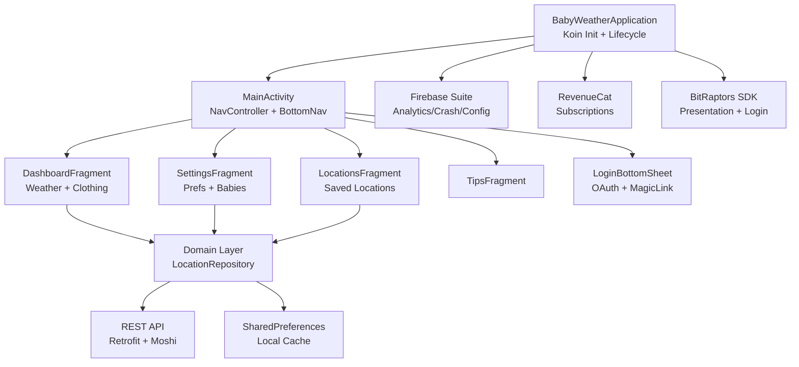

# local/BabyWeather.Android — Architecture Map

> BabyWeather.Android is a native Android app providing weather-based clothing recommendations for babies. Built with Kotlin, Jetpack (Navigation, ViewModel, Flow), and Koin DI. Architecture uses feature-sliced modules (page_*) each owning Fragment, ViewModel, Controller, and Koin module. Domain layer centralizes repository interfaces and REST API communication via Retrofit+Moshi. Firebase suite handles analytics, crash reporting, and remote config; RevenueCat manages subscriptions.

**Architecture:** Feature-sliced MVVM with centralized domain layer and Koin DI | **Platforms:** mobile-android | **Generated:** 2026-03-13

## Architecture Diagram



## Directory Structure

```
BabyWeather.Android/
├── app/
│   ├── build.gradle.kts
│   ├── proguard-rules.pro
│   ├── src/
│   │   ├── main/
│   │   │   ├── AndroidManifest.xml
│   │   │   ├── kotlin/com/bitraptors/babyweather/
│   │   │   │   ├── BabyWeatherApplication.kt
│   │   │   │   ├── activity_main/
│   │   │   │   ├── page_dashboard/
│   │   │   │   ├── page_locations/
│   │   │   │   ├── page_settings/
│   │   │   │   ├── page_settings_detail/
│   │   │   │   ├── page_baby_settings/
│   │   │   │   ├── page_tips/
│   │   │   │   ├── page_subscription_detail/
│   │   │   │   ├── page_feedback/
│   │   │   │   ├── page_login_bottomsheet/
│   │   │   │   ├── common/domain/
│   │   │   │   ├── baseclasses/
│   │   │   │   ├── sdk/
│   │   │   │   └── util/services/
│   │   │   └── res/
│   │   │       ├── layout/, drawable/, navigation/, values*/
│   │   ├── debug/
│   │   ├── staging/  (google-services.json, launcher icons)
│   │   └── release/  (google-services.json, launcher icons)
│   └── staging|release/output-metadata.json
├── buildSrc/
│   ├── build.gradle.kts
│   └── src/main/kotlin/
│       ├── Dependencies.kt
│       ├── DependencyConfig.kt
│       ├── Extensions.kt
│       └── Release.kt
├── build.gradle.kts
├── settings.gradle.kts
├── android-debug.jks
└── babyweather_release
```

## Module Guide

### Application/Process Layer
**Location:** `app/src/main/java/com/bitraptors/babyweather/`

Koin DI init, process lifecycle, analytics/crash setup, dark mode init

| File | Description |
|------|-------------|
| `app/src/main/AndroidManifest.xml` | App manifest, permissions, activity declarations |

**Depends on:** Domain Layer, Infrastructure/SDK Layer

- **BabyWeatherApplication**: Composes all Koin modules; observes ProcessLifecycleOwner

### Activity/Navigation Layer
**Location:** `app/src/main/java/com/bitraptors/babyweather/activity_main/`

NavController host, bottom nav, global dialogs, theme observation

| File | Description |
|------|-------------|
| `app/src/main/res/navigation/navigation_main.xml` | Full app navigation graph |
| `app/src/main/res/layout/activity_main.xml` | Root layout with NavHostFragment and bottom nav |

**Depends on:** Feature Layer, Domain Layer

- **MainController**: Exposes navigation SharedFlows and current page StateFlow

### Feature Layer (page_*)
**Location:** `app/src/main/java/com/bitraptors/babyweather/page_*/`

User-facing screens: dashboard, locations, settings, tips, baby profiles, subscriptions

| File | Description |
|------|-------------|
| `app/src/main/res/layout/fragment_dashboard.xml` | Home screen layout |
| `app/src/main/res/layout/fragment_settings.xml` | Settings screen layout |

**Depends on:** Domain Layer, Common/Shared Layer

- **DashboardViewModel**: Manages weather display state and baby profile selection

### Domain Layer
**Location:** `app/src/main/java/com/bitraptors/babyweather/common/domain/`

Repository interfaces, domain entities, DataSource abstraction, API DTOs

| File | Description |
|------|-------------|
| `app/src/main/res/xml/network_security_config.xml` | Network security policy |
| `app/src/main/res/xml/remote_config_defaults.xml` | Firebase Remote Config defaults |

**Depends on:** Infrastructure/SDK Layer

- **LocationRepository**: Weather data access; exposes time-of-day flow for theme switching

### Build Configuration
**Location:** `buildSrc/src/main/kotlin/`

Centralized version management, dependency declarations, build plugins

| File | Description |
|------|-------------|
| `buildSrc/src/main/kotlin/Dependencies.kt` | All dependency version constants |
| `buildSrc/src/main/kotlin/Release.kt` | versionCode and versionName |
| `app/build.gradle.kts` | App module build config with all buildTypes and signingConfigs |

- **Dependencies.kt objects**: Version constants and dependency strings

## Common Tasks

### Add a new feature screen
**Files:** `app/src/main/res/layout/fragment_<feature>.xml`, `app/src/main/res/navigation/navigation_main.xml`

1. 1. Create page_<feature>/ dir with Fragment.kt, ViewModel.kt, Modules<Feature>.kt
2. 2. Add fragment_<feature>.xml layout in res/layout/
3. 3. Register destination in navigation_main.xml with SafeArgs arguments if needed
4. 4. Add Modules<Feature> to startKoin{} modules list in BabyWeatherApplication

### Add a new REST API endpoint
**Files:** `buildSrc/src/main/kotlin/Dependencies.kt`

1. 1. Add @JsonClass(generateAdapter=true) DTO data class in common/domain/api/dto/
2. 2. Add suspend fun to APIService interface with @GET/@POST/@PUT/@DELETE annotation
3. 3. Add mapping function in Repository implementation; expose via repository interface
4. 4. Inject repository into feature ViewModel via Koin; call in viewModelScope.launch{}

### Add a new build dependency
**Files:** `buildSrc/src/main/kotlin/Dependencies.kt`, `buildSrc/src/main/kotlin/DependencyConfig.kt`, `app/build.gradle.kts`

1. 1. Add version constant to appropriate object in buildSrc/src/main/kotlin/Dependencies.kt
2. 2. Add dependency string constant referencing the version constant
3. 3. Reference via object accessor in app/build.gradle.kts dependencies block (e.g. Libraries.newLib)

### Change app version
**Files:** `buildSrc/src/main/kotlin/Release.kt`

1. 1. Update versionCode (format: YYYYMMDDnn) in Release.kt
2. 2. Update versionName (semantic: X.Y.Z) in Release.kt
3. 3. Commit; Azure Pipelines will pick up new values on next triggered build

## Gotchas

### Koin module registration
Feature Koin modules not added to BabyWeatherApplication startKoin{} block cause runtime NoBeanDefFoundException—no compile-time safety.

*Recommendation:* Always add new Modules<Feature>.kt to the modules list in BabyWeatherApplication immediately when creating a feature

### Moshi codegen
DTOs missing @JsonClass(generateAdapter=true) compile without error but fail at runtime with JsonDataException.

*Recommendation:* Annotate every DTO used with Moshi; enable kapt strict mode to catch missing adapters at build time

### Signing credentials in source
app/build.gradle.kts contains plaintext keystore passwords (WeatherBaby, BabyWeather) and OAuth tokens in buildConfigField.

*Recommendation:* Rotate passwords to Azure Pipelines variable group 'babyweather-android-build-variables'; never commit real credentials

### Flow collection in Fragments
Collecting StateFlow/SharedFlow outside repeatOnLifecycle(STARTED) causes events to be processed when Fragment is stopped.

*Recommendation:* Always wrap flow collection in lifecycleScope.launch { repeatOnLifecycle(Lifecycle.State.STARTED) { ... } }

### Staging vs Release Firebase config
Staging uses production Firebase project (babyweather-ad243), not a separate staging Firebase project—analytics and crash data mingles.

*Recommendation:* Treat staging Firebase data as potentially polluted; filter by app_version or variant in Firebase console

## Technology Stack

| Category | Name | Version | Purpose |
|----------|------|---------|---------|
| language | Kotlin | 1.8.20 | Primary application language |
| ui_framework | AndroidX Fragment + Jetpack | varies | Fragment lifecycle, ViewModel, Navigation Component |
| dependency_injection | Koin | 3.x | Service locator DI container |
| networking | Retrofit 2 + OkHttp | 2.9.0 / 4.9.2 | REST API client with interceptors |
| serialization | Moshi | 1.12.0 | JSON serialization with Kotlin codegen |
| async | Kotlin Coroutines + Flow | 1.6.0 | Async operations and reactive state streams |
| navigation | AndroidX Navigation + SafeArgs | 2.4.2 | Fragment navigation graph with typed args |
| layout | ConstraintLayout / MotionLayout | varies | Primary XML layout engine; scene animations |
| list_adapter | hannesdorfmann/adapterdelegates4 | 4.x | Composable RecyclerView adapter delegates |
| firebase | Firebase Suite (Analytics, Crashlytics, Perf, RemoteConfig) | varies | Crash reporting, analytics, feature flags |
| monetization | RevenueCat | varies | In-app subscription management |
| analytics | Mixpanel | varies | Custom event tracking |
| image_loading | Glide | varies | Image loading and caching |
| animation | Lottie | varies | JSON-based animations |
| internal_sdk | BitRaptors SDK Android | private | Base presentation, login, feature flags, analytics kit |

## Run Commands

```bash
# debug_build
./gradlew assembleDebug

# staging_build
./gradlew assembleStaging

# release_build
./gradlew assembleRelease

# unit_tests
./gradlew cleanTestDebugUnitTest testDebugUnitTest

# install_debug
./gradlew installDebug

```
